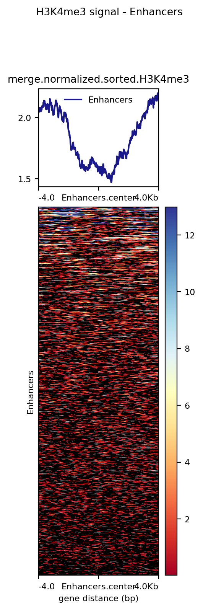
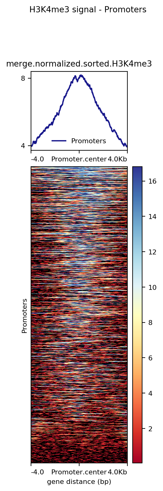

# ¿Hay mayor enriquecimiento de la histona X en los promotores o en los fragmentos? (Probarlo estadísticamente)

**Razon biologica de la histona**: En este trabajo elegimos la histona H3K4me3 ya que ha sido ligada al proceso de 'pre-mRNA splicing', donde se eliminan los intrones del RNA y dejan solamente los exones. Es decir, se le asocia generalmente con promotores activos y regiones transcritas.

## Procesamiento de archivos BED

### Descarga de archivos

Para obtener los archivos BED, se usaron datos de interacciones de Hi-C para monocitos obtenidos de acuerdo a las instrucciones del artículo de Javierre et al. (2016).

```{bash Descarga_archivos, eval=FALSE}
# Generar la carpeta de los datos
mkdir paper_data

# Ubicacion de la carpeta
cd /mnt/Timina/bioinfoII/arodriguez/Prom_vsEnhn/paper_data

# Descargar la carpeta de archivos
wget https://www.cell.com/cms/10.1016/j.cell.2016.09.037/attachment/5bc79f6f-1b69-4192-8cb8-4247cc2e0f39/mmc4.zip

# Descomprimir carpetas
unzip mmc4.zip
unzip DATA_S1.zip
```

### Filtrar información sobre monocitos

Posteriormente, nos concentramos en el archivo `ActivePromoterEnhancerLinks. tsv`, el cual es una tabla delimitada por *tabs* que enumera todas las interacciones detectadas entre promotores activos y **enhancers**. Estos se definen con base a las anotaciones de Regulatory Build y BLUEPRINT.

```{bash Linea_celular, eval=FALSE}
# Escogemos la linea celular MON
grep Mon ./paper_data/ActivePromoterEnhancerLinks.tsv > ./Mon.tsv

# Sacar solamente las columnas 1,2,3 y guardarlas en 'promoters.bed'
# Las columnas son "baits"
awk '{print $1,$2,$3}' Mon.tsv > promoters.bed

# Sacar solamente las columnas 5,6,7 y guardarlas en 'enhancers.bed'
# Las columnas son "ohter ends"
awk '{print $5,$6,$7}' Mon.tsv > enhancers.bed
```

### Conversión de información 

Necesitamos cambiar las posiciones de los archivos BED ya que están basados en la versión del genoma de referencia GRCh37 según el artículo, y los archivos bigWig de Blueprint están basados en el genoma de referencia GRCh38.  

Para esto, utilizamos el comando `liftOver` para generar esta conversion, sin embargo, es necesario un archivo **chain** que contiene los datos para convertir hgX --> hgY.

```{bash Conversion, eval=FALSE}
# Chain file
wget https://hgdownload.cse.ucsc.edu/goldenpath/hg19/liftOver/hg19ToHg38.over.chain.gz

# Cargar modulo 
module load UCSC-executables/ucsc

# Promoters_data_paper_38.bed = promoters38.bed, el archivo 'notpassed-promoters38Mon.bed' contiene las posiciones en el genoma que no pudieron ser cambiadas.
liftOver promoters.bed hg19ToHg38.over.chain.gz promoters38.bed notpassed-promoters38Mon.bed

# Enhancers_data_paper_38.bed = enhancers38.bed, el archivo 'notpassed-enhancers38Mon.bed' contiene las posiciones en el genoma que no pudieron ser cambiadas. 
liftOver enhancers.bed hg19ToHg38.over.chain.gz enhancers38.bed notpassed-enhancers38Mon.bed
```

### Descarga de archivos BigWig (datos de señalización)

Decidimos utilizar 3 muestras, la muestra 'C0011I', 'C001UY' y 'C0010K'.

**C0011I**: Muestra de una mujer de 50 a 55 años. Tipo celular CD14 positivo, CD16 negativo y sangre venosa de tipo tisular.

**C001UY**: Muestra de un varón de 60 a 65 años. Tipo celular CD14 positivo, CD16 negativo y sangre venosa de tipo tisular.

**C0010K**: Muestra de una mujer de 60 a 65 años. Tipo celular CD14 positivo, CD16 negativo y sangre venosa de tipo tisular.

```{bash Bigwigs, eval=FALSE}

# C0011IH1
wget http://ftp.ebi.ac.uk/pub/databases/blueprint/data/homo_sapiens/GRCh38/venous_blood/C0011I/CD14-positive_CD16-negative_classical_monocyte/ChIP-Seq/NCMLS/C0011IH1.ERX197165.H3K4me3.bwa.GRCh38.20150529.bw

wget http://ftp.ebi.ac.uk/pub/databases/blueprint/data/homo_sapiens/GRCh38/venous_blood/C0011I/CD14-positive_CD16-negative_classical_monocyte/ChIP-Seq/NCMLS/C0011IH1.ERX197159.Input.bwa.GRCh38.20150529.bw

# C001UYH2
wget http://ftp.ebi.ac.uk/pub/databases/blueprint/data/homo_sapiens/GRCh38/venous_blood/C001UY/CD14-positive_CD16-negative_classical_monocyte/ChIP-Seq/NCMLS/C001UYH2.ERX197168.H3K4me3.bwa.GRCh38.20150528.bw

wget http://ftp.ebi.ac.uk/pub/databases/blueprint/data/homo_sapiens/GRCh38/venous_blood/C001UY/CD14-positive_CD16-negative_classical_monocyte/ChIP-Seq/NCMLS/C001UYH2.ERX197161.Input.bwa.GRCh38.20150528.bw

# C0010KH1
wget http://ftp.ebi.ac.uk/pub/databases/blueprint/data/homo_sapiens/GRCh38/venous_blood/C0010K/CD14-positive_CD16-negative_classical_monocyte/ChIP-Seq/NCMLS/C0010KH1.ERX197167.H3K4me3.bwa.GRCh38.20150528.bw

wget http://ftp.ebi.ac.uk/pub/databases/blueprint/data/homo_sapiens/GRCh38/venous_blood/C0010K/CD14-positive_CD16-negative_classical_monocyte/ChIP-Seq/NCMLS/C0010KH1.ERX197166.Input.bwa.GRCh38.20150529.bw
```

Los datos se obtuvieron del dataset **[EGAD00001002484](http://dcc.blueprint-epigenome.eu/#/datasets/EGAD00001002484)**.

## Procesamiento de BigWigs por parte de Blueprint

Los pasos que siguieron en Blueprint para procesar los datos, es decir cómo llegaron del fastq al bigwig y qué programas usaron son los siguientes:

### Mapeo

En el mapeo utilizaron bwa 0.7.7 para el genoma humano de referencia GRCh38 (ftp://ftp.ebi.ac.uk/pub/databases/blueprint/reference/20150407_reference_files).

Los comandos usados fueron los siguientes:

```{bash, eval = FALSE}
bwa aln -q 5 grch38.fa input.fastq.gz > intermediate.sai
```

Esta instrucción realiza el alineamiento de secuencias de lectura corta contra un genoma de referencia utilizando BWA con un umbral de calidad mínimo de 5 para el recorte de extremos de baja calidad, y redirige los resultados del alineamiento a un archivo SAI llamado `intermediate.sai`.

```{bash, eval = FALSE}
bwa samse -r "read group information" grch38.fa intermediate.sai input.fastq.gz | samtools view -bS - > output.bam
```

Esta instrucción utiliza BWA para generar un archivo SAM a partir de un archivo SAI y un archivo FASTQ de entrada, y luego utiliza SAMtools para convertir el archivo SAM en un archivo BAM y filtrar las lecturas en función de diferentes criterios. Finalmente, los resultados se redirigen a un archivo de salida en formato BAM llamado `output.bam`. Además, se proporciona información adicional sobre la muestra en el archivo de salida utilizando el argumento `-r`.

Ahora bien, los archivos BAM se clasificaron y se marcaron los duplicados con `picard`:

```{bash, eval = FALSE}
java -Xmx2048m -jar picard/SortSam.jar INPUT=input.bam OUTPUT=output.bam SORT_ORDER=coordinate VALIDATION_STRINGENCY=SILENT
```

Esta instrucción utiliza la herramienta *Picard SortSam* para ordenar un archivo BAM por coordenadas y redirigir la salida a un archivo BAM ordenado llamado `output.bam`. Se especifica el archivo de entrada, el tamaño máximo de memoria asignada, el orden de clasificación, y el nivel de rigurosidad de validación a través de los argumentos del comando.

```{bash, eval = FALSE}
java -Xmx2048m -jar picard/MarkDuplicates.jar INPUT=input.bam OUTPUT=output.bam METRICS_FILE=output.dup_metrics REMOVE_DUPLICATES=false ASSUME_SORTED=true VALIDATION_STRINGENCY=SILENT
```

Esta instrucción utiliza la herramienta *Picard MarkDuplicates* para marcar y eliminar duplicados en un archivo BAM y redirigir la salida a un archivo BAM marcado y sin duplicados llamado `output.bam`. Se especifica el archivo de entrada, el tamaño máximo de memoria asignada, el nombre del archivo de salida de métricas de duplicados, si se deben eliminar duplicados, si el archivo de entrada se asume ordenado y el nivel de rigurosidad de validación a través de los argumentos del comando.

### Filtrado

El archivo bam de salida se filtró para eliminar las lecturas no mapeadas y las lecturas con una calidad de mapeo inferior a 5.

Utilizando el siguiente comando:
```{bash, eval = FALSE}
samtools view -b -F 4 -q 5 input.bam > intermediate.output.bam
```

Esta instrucción utiliza la herramienta *Samtools* para filtrar los alineamientos en un archivo BAM y guardar los resultados en un nuevo archivo BAM llamado `intermediate.output.bam`. Se excluyen los alineamientos que están marcados como no alineados o tienen una calidad de mapeo inferior a 5 mediante los argumentos del comando.

Por otra parte, se filtró el archivo bam de salida intermedio para eliminar las lecturas duplicadas de PCR u ópticas.

```{bash, eval = FALSE}
samtools view -b -F 1024 intermediate.output.bam > output.bam
```

Esta instrucción utiliza la herramienta *Samtools* para filtrar los alineamientos en un archivo BAM y guardar los resultados en un nuevo archivo BAM llamado `output.bam`. Se excluyen los alineamientos que están marcados como duplicados mediante los argumentos del comando.

### Modelo de los tamaños de los fragmentos

El tamaño del fragmento se modeló usando el script `R PhantomPeakQualTool`:

```{bash, eval = FALSE}
run_spp.R -c=output.bam -rf -out=params.out
```

Esta instrucción utiliza el paquete SPP en R para realizar un análisis de *peak calling* en datos de ChIP-seq a partir de un archivo BAM de entrada. Se utiliza una corrección por región de fondo mediante una muestra de control de entrada y se guardan los resultados en un archivo de salida llamado `params.out`.

### Llamadas de pico

*MACS2* (2.0.10.20131216) se utiliza para la llamada de pico con el tamaño de fragmento predicho por *PhantomPeakQualTools*. 

Utilizaron tanto el método estándar de ejecución como la bandera `-broad` en función de la marca en cuestión:

```{bash, eval = FALSE}
macs2 callpeak -t chip.bam -n a_sensible_name --gsize hs -c input.bam --nomodel --shiftsize=half_fragment_size --broad

macs2 callpeak -t chip.bam -n a_sensible_name --gsize hs -c input.bam --nomodel --shiftsize=half_fragment_size
```

Esta instrucción utiliza el paquete `MACS2` para llamar picos a partir de datos de ChIP-seq. Se utiliza un archivo de entrada en formato BAM que contiene los datos de ChIP-seq, así como un archivo de entrada que contiene los datos de entrada (control). Se especifica el tamaño del genoma humano, se desactiva el modelo de fragmentos y se establece el tamaño del desplazamiento a la mitad del tamaño del fragmento. Además, se especifica que se deben llamar regiones anchas en lugar de picos estrechos. Los resultados del análisis de peak calling se guardarán con un nombre descriptivo en un archivo de salida.

Las marcas en las que se utilizaron `-broad` son:  

- H3K27me3  
- H3K36me3  
- H3K9me3  
- H3K4me1  

Las marcas en las que se omitieron `-broad` son:  

- H3K27ac  
- H3K4me3  
- H3K9/14ac  
- H2A.Zac  

### Gráficas de ondulación

Los gráficos de señal se produjeron con *align2RawSignal* utilizando el tamaño de fragmento predicho por *PhantomPeakQualTools*. Se utilizaron archivos fasta y umap específicos del sexo.

```{bash, eval = FALSE}
align2rawsignal -i=chip.bam -of=bg -o=chip.bg -l fragment_size -s=/path/to/fasta_files -u=/path/to/umap_files
```

Esta instrucción convierte los datos de ChIP-seq en archivos de señal brutos para su posterior procesamiento y análisis. Se utiliza un archivo de entrada en formato BAM que contiene los datos de ChIP-seq, y se especifica el formato de salida deseado (bedGraph) y el nombre del archivo de salida. También se especifica el tamaño del fragmento de ADN utilizado en la preparación de las muestras, así como la ruta al archivo de secuencia del genoma de referencia y al archivo de mapa único utilizado para filtrar los duplicados.

### Formatos de salida

Los bed convertidos en BigBed contienen las siguientes columnas:  

- chrom  
- start  
- end  
- name  
- score (fold enrichment * 10, rounded down to integer value)  
- strand  
- -log10(qvalue)  
- -log10(pvalue)  
- fold_enrichment  
    
## Normalización y fusión de BigWigs

Por otro lado, como *align2rawsignal* no implementa correcciones input-ADN/control vamos a normalizar nuestros archivos utilizando el log2 de la relación entre el tratamiento y el archivo de entrada con los siguientes comandos: 

```{bash BAM_bigwigs, eval=FALSE}

# Directorio de trabajo 
cd /mnt/Timina/bioinfoII/mrivera/Promoters/BigWigs

# Carga de modulo
module load deeptools/2.5.3
module load UCSC-executables/ucsc

# C0010K
bigwigCompare -b1 C0010KH1.ERX197167.H3K4me3.bwa.GRCh38.20150528.bw -b2 C0010KH1.ERX197166.Input.bwa.GRCh38.20150529.bw -o ./normal_data/C0010KH1.normalized.bwa.GRCh38.20150528.bw

# C0011I
bigwigCompare -b1 C0011IH1.ERX197165.H3K4me3.bwa.GRCh38.20150529.bw -b2 C0011IH1.ERX197159.Input.bwa.GRCh38.20150529.bw -o ./normal_data/C0011IH1.normalized.bwa.GRCh38.20150529.bw

# C001UY
bigwigCompare -b1 C001UYH2.ERX197168.H3K4me3.bwa.GRCh38.20150528.bw -b2 C001UYH2.ERX197161.Input.bwa.GRCh38.20150528.bw -o ./normal_data/C001UYH2.normalized.bwa.GRCh38.20150528.bw

```

Esta instrucción se utiliza para comparar dos archivos bigWig y generar un archivo de salida que contenga los resultados de la comparación. Se especifican los nombres de los dos archivos bigWig que se utilizarán en la comparación y se indica el nombre y la ubicación del archivo de salida que se generará.

Una vez realizada la normalización, procederemos a fusionar los ficheros normalizados. Esta fusión de ficheros se lleva a cabo asumiendo que las réplicas son lo suficientemente similares.

```{bash merging, eval=FALSE}
# Directorio
cd /mnt/Timina/bioinfoII/mrivera/Promoters/BigWigs/normal_data

# Cargar modulo
module load UCSC-executables/12may2022

# Merging
bigWigMerge C0010KH1.normalized.bwa.GRCh38.20150528.bw C0011IH1.normalized.bwa.GRCh38.20150529.bw C001UYH2.normalized.bwa.GRCh38.20150528.bw merge.normalized.H3K4me3.bedGraph
```

La instrucción `bigWigMerge` combina la señal de los tres archivos de formato bigWig y la guarda en un archivo llamado `merge.normalized.H3K4me3.bedGraph` para posteriormente visualizar la señal de todos los datos combinados en el genoma.

Ahora, tenemos que convertir el archivo bedGraph fusionado en un BigWig. Para ello, primero ordenamos el archivo bedGraph teniendo en cuenta las recomendaciones leídas en [Biostars](https://www.biostars.org/p/176875/).

```{bash, eval=FALSE}
# Ordenamiento
sort -k1, 1 -k2, 2n merge.normalized.H3K4me3.bedGraph > merge.normalized.sorted.H3K4me3.bedGraph

# Tamaños de cromosoma
wget https://www.encodeproject.org/files/GRCh38_EBV.chrom.sizes/@@download/GRCh38_EBV.chrom.sizes.tsv
```

Esta instrucción ordena el archivo bedGraph `merge.normalized.H3K4me3.bedGraph` primero por cromosoma (primera columna) y luego por posición (segunda columna), y guardará el resultado ordenado en un nuevo archivo llamado `merge.normalized.sorted.H3K4me3.bedGraph`.

Después, convertiremos el bedGraph a bigWig usando el siguiente comando:

```{bash, eval=FALSE}
# Cargar modulo
module load bedtools/2.27.1

# Comando
bedGraphToBigWig H3K4me3-sorted2.bedGraph GRCh38_EBV.chrom.sizes.tsv H3K4me3-norm.bw
```

Esta instrucción convierte el archivo bedGraph `H3K4me3-sorted2.bedGraph` en un archivo bigWig llamado `H3K4me3-norm.bw`, utilizando la información sobre los tamaños de los cromosomas en la referencia genómica especificada en el archivo `GRCh38_EBV.chrom.sizes.tsv`.

Una vez hecho esto, vamos a generar los heatmaps de promotores y enhancers usando la siguiente línea de código:

```{bash, eval=FALSE}

# Directorio 
cd /mnt/Timina/bioinfoII/arodriguez/Prom_vsEnhn

# Cargar modulo
module load deeptools/2.5.3

# Computar la matriz promoters
computeMatrix reference-point -S ./merge.normalized.sorted.H3K4me3.bw -R ./promoters38.bed --referencePoint center -a 4000 -b 4000 -out matrix_Promoters_H3K4me3_normalized_matrix.tab.gz

# Heatmap promoters
plotHeatmap -m ./matrix_Promoters_H3K4me3_normalized_matrix.tab.gz -out H3K4me3_Promoters_normalized.png --heatmapHeight 15 --refPointLabel Promoter.center --regionsLabel Promoters --plotTitle ' H3K4me3 signal - Promoters'

# Computar la matriz enhancers
computeMatrix reference-point -S merge.normalized.sorted.H3K4me3.bw -R ./enhancers38.bed --referencePoint center -a 4000 -b 4000 -out matrix_Enhancers_H3K4me3_normalized_matrix.tab.gz

# Heatmap enhancers
plotHeatmap -m ./matrix_Enhancers_H3K4me3_normalized_matrix.tab.gz -out H3K4me3_Enhancers_normalized.png --heatmapHeight 15 --refPointLabel Enhancers.center --regionsLabel Enhancers --plotTitle ' H3K4me3 signal - Enhancers'

```





Con estos heatmaps podemos observar que hay mayor enriquecimiento de la histona H3K4me3 en promotores ya que todas las regiones analizadas están por encima de 4 y las regiones de los enhancers analizadas presentan puntuaciones por debajo de 2.5 aproximadamente. 

## Análisis estadístico 

Para observar si hay mayor enriquecimiento de la histona H3K4me3 en los promotores o en los enhancers, realizaremos una prueba de comparación de medias entre ambas matrices. Para ello, primeramente comprobaremos la normalidad de los datos utilizando `qqplots.`

```{r}
setwd("~/Documents/ENES/4toSem/Bioinfo/T02/Bioinformatica/Promotores_enhanc")

#Cargar los datos 
Promoters_data<-read.delim("./matrix_Promoters_H3K4me3_normalized_matrix.tab.gz", header = FALSE, sep = "\t",quote = "")
Enhancers_data<-read.delim("./matrix_Enhancers_H3K4me3_normalized_matrix.tab.gz", header = FALSE, sep = "\t",quote = "")

# Convertir los NAs en 0
Promoters_data[is.na(Promoters_data)] = 0 
Enhancers_data[is.na(Enhancers_data)] = 0

# Remover el título
Promoters_data<-Promoters_data[-1,]
Enhancers_data<-Enhancers_data[-1,]

# Remover las columnas que son de interés
Promoters_data<-Promoters_data[,-c(1,2,3,4,5,6)]
Enhancers_data<-Enhancers_data[,-c(1,2,3,4,5,6)]

# Calcular la media de cada fila de la matriz
Promoters_row_means <- data.frame(ROW_MEANS=rowMeans(Promoters_data))
Enhancers_row_means <- data.frame(ROW_MEANS=rowMeans(Enhancers_data))

# Generating the qqplot
qqnorm(Promoters_row_means$ROW_MEANS, pch = 19, col = "blue",main="Promoters (Figura 3)")
qqline(Promoters_row_means$ROW_MEANS)

qqnorm(Enhancers_row_means$ROW_MEANS, pch = 19, col = "red",main="Enhancers (Figura 4)")
qqline(Enhancers_row_means$ROW_MEANS)
```

Observando las ggplots podemos decir que los datos no son normales, ya que varios puntos de ambos gráficos no siguen la línea recta en una medida considerable. 

Por tanto, ahora utilizaremos una prueba no paramétrica como la prueba de Wilcoxon para realizar el análisis de comparación de medias entre promotores y enhancers.

```{r}
#Wilcoxon test
wilcox.test(Promoters_row_means$ROW_MEANS,Enhancers_row_means$ROW_MEANS,alternative = "two.sided",mu=0, paired=F, conf.int = T, conf.level = 0.99)
```

Esta prueba con un intervalo de confianza del 99% nos arrojó un valor p inferior a 2.2e-16, lo que nos dice que hay una diferencia significativa entre la media de los datos de promotores y enhancers. 
El intervalo de confianza va desde  2.944456 a 3.030544 siendo este positivo, así que, la media de los datos de los promotores es mayor que la media de los datos de los enhancers. Así, podemos concluir que hay enriquecimiento significativo para la modificación de la histona H3K4m3 en las regiones promotoras.

## Pipeline de FastQ a BigWig

Los archivos bigwig utilizados en este análisis, se obtuvieron a partir de fastq obtenidos mediante secuenciación. Pasaron por controles de calidad, como que la longitud de lectura debía tener una longitud mínima de 50 pb.

También, los archivos únicos se alinearon en archivos bam y se realizó otro control de calidad de los archivos resultantes y se filtraron para crear un segundo archivo bam dada la calidad.


# ¿Qué factores transcripcionales se encuentran enriquecidos en ambos sets de secuencias (promotores y fragmentos)?

## *Pattern Matching*

El *pattern matching* consiste en buscar sitios reconocidos por un factor de transcripción conocido, y requiere conocimiento previo del motivo que describe la especificidad vinculante de este factor de transcripción.

Zhu et al. (2016) identificó varios factores transcripcionales que están involucrados en el desarrollo de células monociticas o presentes en ellas. Uno de esos factores es la **SFPI1**, que desempeña un papel crucial en las primeras etapas de la monopoyesis. Otro factor, **CEBPB**, se asocia con el compromiso de las células para diferenciarse en monocitos o granulocitos. **IRF8** promueve la diferenciación en monocitos y permanece activo en monocitos diferenciados. **FLI1** ayuda en la diferenciación de los monocitos mediante la regulación negativa de los genes implicados en el desarrollo de las células mieloides. Finalmente, **NR4A1**, un protooncogén altamente expresado en monocitos, controla su diferenciación y supervivencia mediante la prevención de la apoptosis y el avance de la fase S del ciclo celular.

Nos gustaría investigar qué motivos de ADN dentro de los promotores y potenciadores detectados en el experimento Hi-C de Javierre et al. (2016) para monocitos están sobrerrepresentados en comparación con otros motivos del mismo tamaño, utilizando los factores transcripcionales antes mencionados como base para nuestro análisis.

### Obtención de secuencias (archivo fasta)

Para ello, lo primero que necesitamos es filtrar y obtener las regiones en las que nos interesa encontrar los motivos, que en este caso corresponden a las secuencias conjuntas de promotores y enhancers. 

Conseguimos este archivo usando el programa `bedops`, que es una herramienta usada para encontrar relaciones entre dos o más conjuntos de datos genómicos. En este caso utilizamos la función `–intersect`, que nos permite poner un archivo `. bed` que contiene las regiones comunes en ambos ficheros de entrada.

```bash
module load bedops/2.4.20
bedops --intersect enhancers38.bed promoters38.bed > enh_pro_intersection.bed
```

Una vez hecho esto, para eliminar ordenar el archivo y eliminar las posiciones repetidas, utilizamos los comandos `sortBed` y `uniq`, respectivamente:

```bash
module load bedtools/2.27.1
# Ordentar
sortBed -i enh_pro_intersection.bed > enh_pro_intersection_sorted.bed
# Eliminar duplicados 
cat enh_pro_intersection_sorted.bed | uniq > enh_pro_intersection_sorted_unique.bed
# Descargar a local
rsync -chavzP arodriguez@dna.lavis.unam.mx:/mnt/Timina/bioinfoII/arodriguez/Prom_vsEnhn/enh_pro_intersection_sorted_unique.bed .
```

Para obtener los archivos fasta con la secuencia del genoma de referencia en las posiciones anteriores, se usó la herramienta `fetch-sequences` de RSAT (con el siguiente [link](http://rsat.sb-roscoff.fr/fetch-sequences_form.php)). Dentro de esta página se utilizó la siguiente configuración:

- **Genome**: hg38 - Human Dec.2013 (GRCh 38/hg38).
- **Genomic coordinates**: se subió el archivo `enh_pro_intersection_sorted_unique.bed`.
- **Header Format**: UCSC
- **Reference from which the sequences should be fetched**: fragment.

Esto nos da un archivo `.bed` con las coordenadas genómicas, uno `.fasta` con las secuencias obtenidas, y finalmente un `.txt` con inforación sobre el *job* enviado. Procedimos a descargar el archivo FASTA en el cluster

```bash
# Descargarlo a clsuter
wget -O fetched_seq3.fasta http://rsat.sb-roscoff.fr//tmp/apache/2023/04/10/enh_pro_intersection_sorted_unique_7nzy_20230410_204751.fasta
```

### Escaneo de sequencias de ADN

Para checar la sobrerepresentación de motivos para factores transcripcionales conocidos en las secuencias anteriores, se necesita una **matriz de frecuencias** para cada nucleótido en motivos conocidos para el factor transcripcional de interés (*Position-specific scoring matrix*, PSSM), además un **modelo de fondo** que indique la probabilidad de observar cierto nucleótido en un sitio de las secuencias de referencia. 

<div class="alert alert-block alert-info">
**NOTA**: El programa `matrix-scan` soporta modelos de fondo de Bernoulli que asumen independencia entre residuos sucesivos, así como cadenas Markov de orden superior, donde la probabilidad de encontrar un residuo en una posición dada depende de los residuos encontrados en las posiciones $m$ anteriores ($m$ es el orden de la cadena Markov). Markov modelos de orden $m$ determinan las frecuencias de palabras de longitud $k = m + 1$. Una cadena de orden Markov 0 corresponde a un modelo Bernoulli.
</div>

Una medida que es útil para comprobar qué secuencias podrían corresponder a motivos para el TF y no necesariamente a secuencias con mayor probabilidad de aparecer por la composición de las secuencias de referencia es el **peso**, calculado por $W=log( \frac{P(S|M)}{P(S|B)})$, donde $P(S|M)$ es la probabilidad para el segmento de secuencia $S$ de ocurrir de acuerdo al modelo del motivo $M$ (la matriz PSSM), mientras que $P(S|B)$ es la probabilidad para la mismo fragmento de secuencia $S$ de ocurrir bajo el modelo de fondo $B$. 

Conforme más grande sea el peso para una secuencia ($W_s$), quiere decir que tiene **mayor probabilidad de corresponder a un motivo del TF** dado por la matriz de frecuencias, a ser solamente una secuencia con alta probabilidad de ocurrir debido a la composición de las secuencias de referencia. 

Como cada matriz de frecuencias tiene un número fijo de posiciones $w$, sólo es posible identificar motivos de esta longitud; de manera que además se puede aprovechar esta propiedad para calcular el peso para cada una de los posibles secuencias con longitud igual al número de posiciones $w$ en la matriz de frecuencias. Con base en la distribución de los pesos para las secuencias de longitud $w$ dados el modelo de fondo y la matriz de promotores, se puede elegir un threshold para el p-valor $p$ de tal forma que la probabilidad de obtener un peso mayor o igual a $*W_s$ al muestrear un peso de la distribución de pesos anterior es $p$; y quedarnos con aquellas secuencias que tienen asociadas un peso mayor o igual $W_s$.

De esta forma, el p-valor es la probabilidad de obtener una puntuación dada por casualidad, y se puede utilizar para estimar la probabilidad de considerar erróneamente un *hit* como significativo. Por lo tanto, el umbral puede interpretarse directamente como un riesgo de falsos positivos. Para esta tarea se utilizó un p-valor de .001 para todas las matrices de algún TF. 

Para llevar a cabo lo anterior de manera práctica con la pregunta que nos interesa, en la página de RSAT, se utilizó la herramienta `matrix-scan` ([http://rsat.sb-roscoff.fr/matrix-scan_form.cgi](http://rsat.sb-roscoff.fr/matrix-scan_form.cgi)) con los siquientes parámetros:

- **Sequence**: se subió el archivo `fetched_seq3.fasta`.
- ***Mask***: non-dna
- **Matrix (or matrices)**: Dynamic selection of motifs from the available collections con los siguientes parámetros:
    - **Database**: JASPAR
    - **Collection**: JASPAR core nonredundant vertebrates (2020)
    - **Matrix identifiers**: CEBPB- MA0466.2, FLI1 - MA0475.2, IRF8 - MA0652.1, NR4A1 - MA1112.2, SPI1 - MA0080.5
- **Pseudo-counts**: 1, distributed proportionally to residues priors.
- **Background model estimation method**: Markov order 1, estimate residue probabilities from input sequences.
- **Pseudo-frequencies**: 0.01
- **Scanning options**
    - **Search strands**: both
    - ***Origin***: end
    - ***Offset***: 0
    - ***Score decimals***: 1
    - **handling of N characters**: score

```bash
# En linea de comando
matrix-scan  -v 1 -matrix_format transfac -m $RSAT/public_html/tmp/apache/2023/04/14/matrix-scan_2023-04-14.080709_yipADz.matrix -pseudo 1 -decimals 1 -2str -origin end -bginput -markov 1 -bg_pseudo 0.01 -return limits -return sites -return pval -return rank -lth score 1 -uth pval 1e-4 -i $RSAT/public_html/tmp/apache/2023/04/14/tmp_sequence_2023-04-14.080709_v3FbWD.fasta -seq_format fasta -n score
```

Se eligieron matrices no redundantes porque puede que existan muchas matrices para factores transcripcionales muy cercanos o de la misma familia que contienen información muy parecida (como sitios de unión conservados), que se puede rescatar en una sola matriz más general. 

Los resultados se muestran en archivos tabulares que contienen información detallada sobre la ubicación de los sitios previstos y sus puntuaciones. Para facilitar la interpretación de los resultados, las coincidencias pueden visualizarse a lo largo de la secuencia escaneada en un *feature map*. En la parte inferior de la página de resultados de matrix-scan, la sección “`Next step`” permite enviar los resultados de matrix-scan directamente como entrada a otro programa RSAT. 


La Figura 5 muestra las predicciones del escaneo de matriz en el promotor de los diferentes TFs de monocito. Las predicciones de sitios individuales se encuentran enriquecidas a lo largo de todos estos fragmentos, lo que nos quiere decir que para la mayoría de estos factores transcripcionales existen motivos en el ADN que se encuentran sobrerepresentados con respecto a otros motivos del mismo tamaño dentro de los promotores y enhancers en el artículos de Javierre et al. (2016). 

Para evaluar la calidad de las predicciones, es fundamental volver a ejecutar el análisis con secuencias que sirvan como control negativo. En este caso, es posible que la permutación de columnas en una matriz de un factor transcripcional específico no identifique motivos con suficiente especificidad dentro del organismo. Por lo tanto, las secuencias identificadas por un mayor peso podrían no reflejar aspectos biológicos, como la especificidad de la secuencia por un factor transcripcional. Estas secuencias no deberían estar enriquecidas en promotores y enhancers, ya que no tienen una función biológica clara, y se podrían considerar como un control negativo para las secuencias que no deberían estar presentes.

Para obtener estas matrices permutadas, descargamos versiones permutadas de los 5 perfiles de TFs en Jaspar. Para los ajustes de permutación utilizamos:

- **Type**: “Whithin each matrix” (para que no estemos sesgados hacia la abundancia de nucleótidos de ciertas regiones TFBS),
- **Format**: MEME.

Una vez descargadas, repetimos el proceso anteriormente descrito con las mismas especificaciones. 


Podemos observar un patrón muy similar al observado en la Figura 5, lo cual nos puede indicar que el enriquecimiento de los motivos de CEBPB, NRA4, SPI1, IRF8 y FLI1 con respecto a otras secuencias del mismo tamaño en las secuencias de promotores y enhancers son cuestionables y requieren de mayor investigación y un análisis más profundo.

# Conclusión

En primer lugar, hay significativamente más enriquecimiento para la modificación de la histona H3K4m3 en regiones promotoras que en regiones enhancers para los monocitos de muestras humanas.

En segundo lugar, se encontró un enriquecimiento de ambos sets de secuencias (promotores y enhancers) en los motivos de los TF CEBPB, NRA4, SPI1, IRF8 y FLI1, sin embargo, este descubrimiento carece de una evidencia sólida y requiere de más investigación.

# Referencias

- 6.1.1. Bedops—BEDOPS v2.4.41. (n.d.). Retrieved April 10, 2023, from https://bedops.readthedocs.io/en/latest/content/reference/set-operations/bedops.html
- BedGraphToBigWig Tutorial and Report. (n.d.). Retrieved April 7, 2023, from https://www.biostars.org/p/176875/
- computeMatrix—DeepTools 3.5.0 documentation. (n.d.). Retrieved April 7, 2023, from https://deeptools.readthedocs.io/en/develop/content/tools/computeMatrix.html
- deepTools2: Compute matrix error. (n.d.). Retrieved April 7, 2023, from https://biostar.usegalaxy.org/p/29209/
- GRCh38_EBV.chrom.sizes – ENCODE. (n.d.). Retrieved April 7, 2023, from https://www.encodeproject.org/files/GRCh38_EBV.chrom.sizes/
- Javierre, B. M., Burren, O. S., Wilder, S. P., Kreuzhuber, R., Hill, S. M., Sewitz, S., Cairns, J., Wingett, S. W., Várnai, C., Thiecke, M. J., Burden, F., Farrow, S., Cutler, A. J., Rehnström, K., Downes, K., Grassi, L., Kostadima, M., Freire-Pritchett, P., Wang, F., … Fraser, P. (2016). Lineage-Specific Genome Architecture Links Enhancers and Non-coding Disease Variants to Target Gene Promoters. Cell, 167(5), 1369-1384.e19. https://doi.org/10.1016/j.cell.2016.09.037
- RSAT - fetch-sequences. (n.d.). Retrieved April 8, 2023, from http://rsat.sb-roscoff.fr/fetch-sequences_form.php
- Turatsinze, J.-V., Thomas-Chollier, M., Defrance, M., & van Helden, J. (2008). Using RSAT to scan genome sequences for transcription factor binding sites and cis-regulatory modules. Nature Protocols, 3(10), Article 10. https://doi.org/10.1038/nprot.2008.97
- Zhu, Y. P., Thomas, G. D., & Hedrick, C. C. (2016). 2014 Jeffrey M. Hoeg Award Lecture: Transcriptional Control of Monocyte Development. Arteriosclerosis, Thrombosis, and Vascular Biology, 36(9), 1722–1733. https://doi.org/10.1161/ATVBAHA.116.304054
- Blueprint DCC portal. (n.d.). Blueprint-Epigenome.Eu. Retrieved April 15, 2023, from http://dcc.blueprint-epigenome.eu/#/md/chip_seq_grch38


